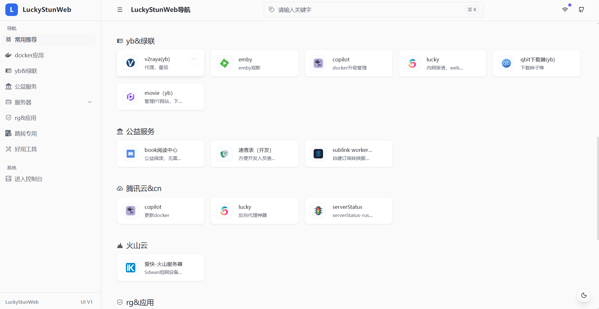
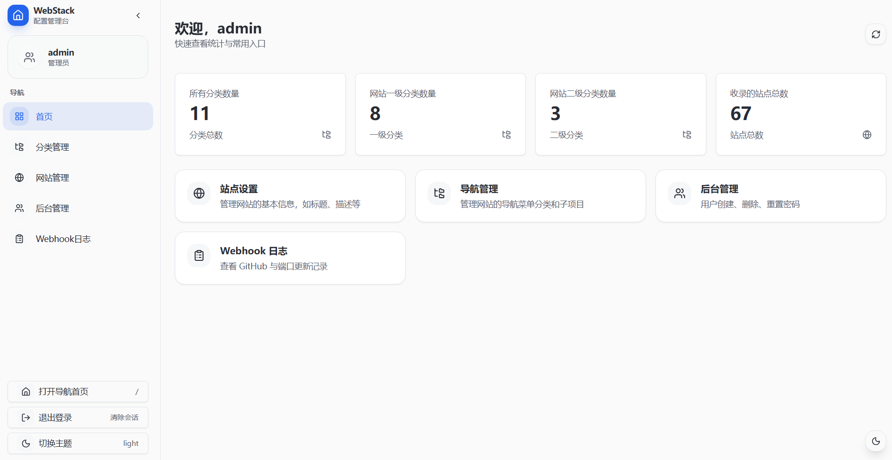

# LuckyStunWeb-next

基于 Next.js 14+ 开发的现代、极简个人导航页系统。专为追求极致体验的私有云用户打造，支持多端自适应、iOS PWA 深度优化、动态数据管理及服务端渲染（SSR）。

---

## 🖼️ 项目预览

<div align="center">
  
  
</div>

---

## 🚀 项目亮点

- **🎨 现代 UI/UX**：基于 shadcn/ui + Tailwind CSS，支持黑白主题无缝切换。
- **📱 PWA 完美支持**：针对 iOS 深度优化，支持 `black-translucent` 沉浸式状态栏。
- **⚡ 极速响应**：采用 Next.js App Router + SSR，首屏秒开，告别白屏闪烁。
- **🛠️ 全能后台**：内置可视化控制台，支持分类/站点 CRUD、批量操作及用户管理。
- **🔗 智能网络切换**：支持“内网/外网/备用”三路地址切换，适配各种复杂的网络环境。
- **🤖 自动化运维**：集成 GitHub Webhook 及 1Panel API，支持自动拉取代码并重启服务。

---

## 🛠️ 环境准备

- **Node.js**: v18.x 或更高版本
- **PostgreSQL**: v12.x 或更高版本
- **包管理器**: npm, yarn 或 pnpm

---

## 📦 快速开始

### 1. 克隆项目
```bash
git clone https://github.com/your-username/LuckyStunWeb-next.git
cd LuckyStunWeb-next
```

### 2. 配置环境变量
复制根目录下的 `.env.local.example` 并重命名为 `.env.local`，根据实际情况修改配置：

```bash
cp .env.local.example .env.local
```

#### **关键变量说明**
| 变量名 | 说明 | 示例 |
| :--- | :--- | :--- |
| `DB_HOST` | 数据库 IP/域名 | `127.0.0.1` |
| `ADMIN_PASSWORD` | 后台初始化密码 | `admin123456` |
| `JWT_SECRET` | 登录鉴权密钥 | 建议生成长随机字符串 |
| `WEBHOOK_SECRET` | Webhook 统一密钥 | 用于 GitHub和lucky面板webhook接口调用 |
| `PANEL_API_KEY` | 1Panel API 密钥 | 用于触发自动化运维任务 |

### 3. 安装依赖并启动
```bash
# 安装依赖
npm install

# 开发环境运行
npm run dev

# 生产环境构建与启动
npm run build
npm run start
```

---

## 📖 进阶教程

### 1. iOS PWA 沉浸式体验
本项目已针对 iOS 桌面书签进行优化。添加至主屏幕后，顶栏将呈现“透明叠层”效果。
- **注意**：建议在导航页右下角手动切换一次主题，以确保状态栏文字颜色（白/黑）与页面背景匹配。

### 2. GitHub Webhook 自动更新
实现“本地 Push，服务器自动构建重启”：
1. 在 GitHub 仓库 `Settings -> Webhooks` 添加地址：`https://你的域名/api/webhook/github`。
2. **Secret** 填写 `.env.local` 中的 `WEBHOOK_SECRET`。
3. 接口接收到通知后，会配合 `PANEL_API` 自动触发服务器端的 1Panel 计划任务拉取代码。

### 3. 端口批量更新 Webhook (Lucky 配合使用)
如果你使用 **Lucky** 等反代工具，当公网 IP 或 DDNS 端口发生变动时，可以利用 Lucky 的“WebHook”功能自动同步端口到导航页：

- **接口地址**: `POST https://你的域名/api/webhook/update-ports`
- **认证方式**: `Authorization: Bearer <你的WEBHOOK_SECRET>`
- **Lucky 配置示例**:
  1. 在 Lucky 的 **WebHook** 模块中新建一个任务。
  2. **接口地址**: 填入上述地址。
  3. **请求方法**: `POST`。
  4. **请求头**: 添加 `Authorization: Bearer 你的密钥`。
  5. **请求体 (Body)**:
     ```json
     {
       "domains": ["你的主域名.com"],
       "port": #{port} 
     }
     ```
     *(注：`#{port}` 是 Lucky 的内置变量，会自动替换为当前最新端口)*
  6. 这样每当 Lucky 自动更新端口后，导航页上对应的外网/内网链接都会自动同步。

- **自定义脚本使用方式**:
  如果你使用 Lucky 的“自定义脚本”模式，可以使用如下 Shell 脚本：
  ```bash
  #!/bin/sh
  
  # Lucky 会自动传入端口变量
  PORT="${port}"
  
  # 发送通知到导航页更新端口
  curl --location 'https://你的域名/api/webhook/update-ports' \
    -H 'Content-Type: application/json' \
    -H 'Authorization: Bearer 你的WEBHOOK_SECRET' \
    -d "{\"port\": ${PORT}, \"domains\": [\"你的主域名.com\"]}"
  ```

---

## 📂 项目结构

```text
├── app/                  # App Router 路由与 API
│   ├── api/              # 后端接口层
│   ├── console/          # 管理后台页面
│   └── navigation-page/  # 前台导航核心
├── components/           # 复用 UI 组件
├── hooks/                # 业务逻辑 Hooks
├── lib/                  # 工具类 (DB, Auth, Logger)
└── public/               # 静态资源与 PWA 清单
```

---

## 🤝 贡献与反馈

欢迎提交 Issue 或 Pull Request！

**License**: MIT
